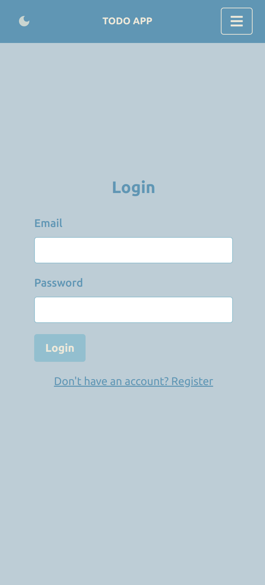
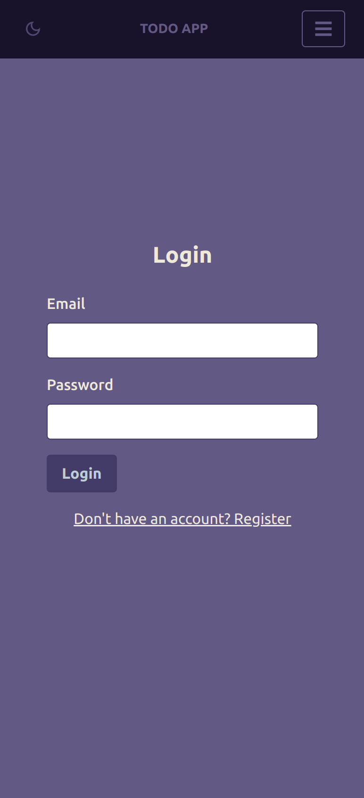
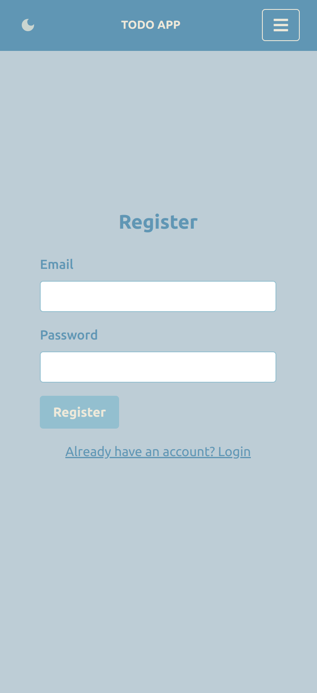
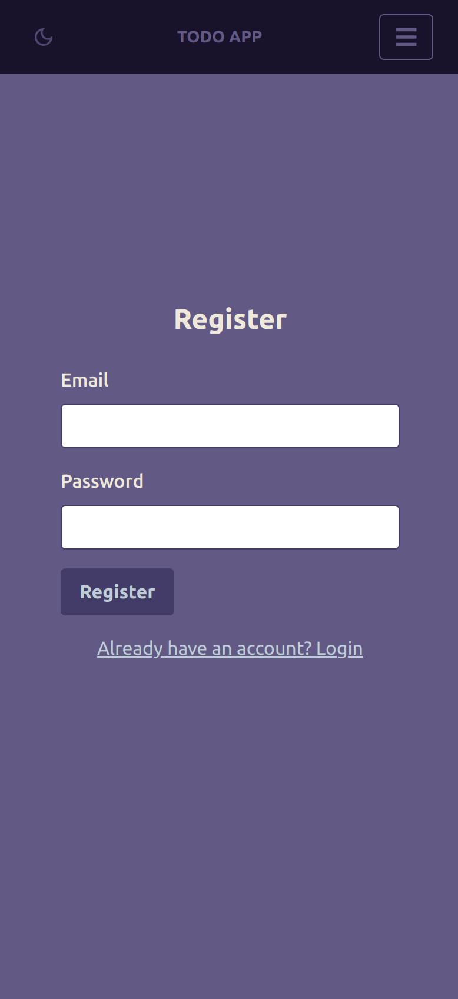
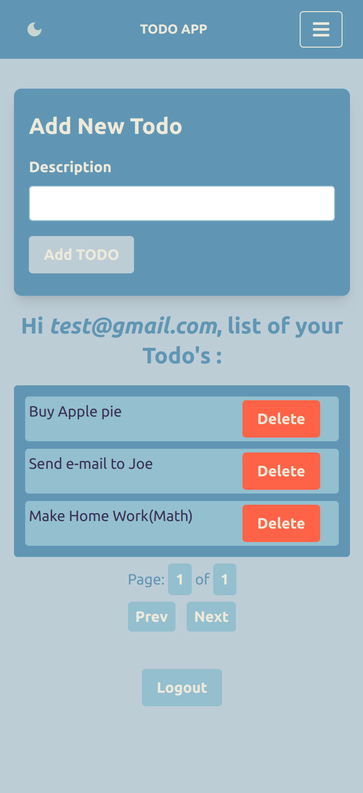
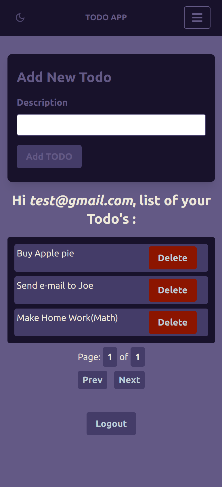

# Responsive application build with MERN, Firebase, Tailwind CSS and Docker.

- Login page - User need to Login to Create Todo and see all Todo's

- Register page - User can create new account wiht email and password

- Todo's page - User can create new Todo's, see all Todo's, delete Todo
- User can see own Todo's only
- I added pagination in case that user need to create big quantity of Todo's

### To build and run app with Docker:

- populate .env file in `/client` folder with **firebase** creadantials.
- populate .env file in `/server` folder with **mongodb** creadantials.

- Enter to `/client` folder, run `docker build -t my-mern-app-frontend .` to create image
- Then `docker run -d --rm -p 5173:5173 --name my-mern-app-frontend my-mern-app-frontend`

- Enter to `/server` folder, run `docker build -t my-mern-app-backend .` to create image
- Then `docker run -d -p 3000:3000 --name my-mern-app-backend my-mern-app-backend`
